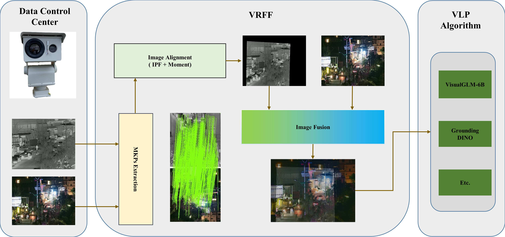

## VRFF
VRFF is a Video Registration and Fusion Framework. VRFF effectively alleviates the flickering issues in video stream fusion. The VRFF framework is sufficiently flexible to rapidly integrate the latest image registration and fusion methods, demonstrating enhanced performance when combined with the VRFF framework. The framework diagram of VRFF is as follows:
<div style="text-align:center;">
    
</div>

###### Note:
When new registration and fusion tasks need to be integrated, they can be encapsulated and extended in the `model/reg` and `model/fuse` folders.

### TODO
* Fixed bug.
* Update the new reg and fuse modules. 


### Install
#### Download this project:
```shell
git clone git@github.com:Meng-Sang/VRFF.git
cd VRFF
```
#### Runtime environment
This project requires a runtime environment with `Python=3.8` or higher. 
```shell
conda create -n VRFF  python=3.8
pip install -r requirement.txt
```
#### Download weights
Download the weight of registration. 
```shell
# If the path model/reg/MatchFormer/weights does not exist, please run the following commands:
# mkdir -p model/reg/MatchFormer/weights
cd model/reg/MatchFormer/weights
wget https://github.com/Meng-Sang/SA-DNet/blob/master/model/reg/MatchFormer/weights/model.ckpt
```
Download the weight of fusion. 
```shell
# If the path model/fuse/MatchFormer/weights does not exist, please run the following commands:
# mkdir -p model/fuse/MatchFormer/weights
cd model/fuse/MatchFormer/weights
wget https://github.com/Meng-Sang/SA-DNet/blob/master/model/fuse/UFusion/weights/model.pth
```


### Demo
#### Download image pairs

Please download the image pair sequences from [MMVS](https://github.com/Meng-Sang/MMVS.git) and [HDO](https://github.com/xiehousheng/HDO.git), and save them to the specified `image_pairs_root_path` location.  The internal structure of `image_pairs_root_path` is as follows:
```shell
image_pairs_root_path:
  -ir:
    1.jpg
    ...
  -vi:
    1.jpg
    ...
```

#### Run with Python

```python
from utils.predict_video import predict_video

if __name__ == "__main__":
    predict_video(image_pairs_root_path, size=(320, 240), ipf_n=47, moment_alpha=0.99, save_path="assets/results/ipf_mom_fuse.avi",is_show=True)
    predict_video(image_pairs_root_path, size=(320, 240), ipf_n=1, moment_alpha=None, save_path="assets/results/fuse.avi", is_show=True)

```
#### Show result
<div style="text-align:center;">
    <table align="center">
  <tr> <td colspan="2"> "4FRnNpmSmwktFJKjg" video of the <a href="https://github.com/Meng-Sang/MMVS.git"> MMVS dataset </a></td> </tr>
  <tr>
    <td align="center">
      
    </td>
    <td align="center">
      
    </td>
  </tr>
  <tr> <td colspan="2">     "a" video of the <a href="https://github.com/xiehousheng/HDO.git">HDO dataset</a></td> </tr>
  <tr>
    <td align="center">
      
      <br>Traditional method
    </td>
    <td align="center">
      
      <br>VRFF
    </td>
  </tr>
</table>
</div>


### Related Works:

The related datasets and projects involved in this work are as follows:
* [MMVS](https://github.com/Meng-Sang/MMVS.git)
* [HDO](https://github.com/xiehousheng/HDO.git)
* [SA-DNet](https://github.com/Meng-Sang/SA-DNet.git)

### Citing
```shell
@inproceedings{sang2024vrff,
  title={VRFF: Video Registration and Fusion Framework},
  author={Meng Sang, Housheng Xie and Yang Yang},
  booktitle={Proceedings of 2024 International Joint Conference on Neural Networks (IJCNN)},
  year={2024},	
  organization={IEEE (Institute of Electrical and Electronics Engineers)}
}
```